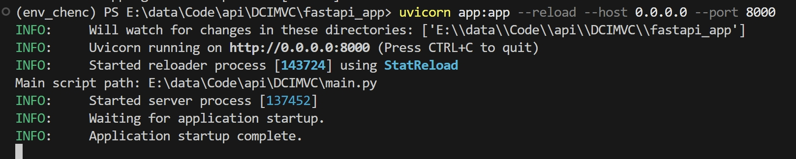

## Dual Contrastive Incomplete Multi-View Clustering with Clustering-Oriented Guidance

### Q1. 为什么开展此软件项目？解决的实际问题是什么？
- 实际背景与核心问题

在多源数据驱动的实际场景（如遥感图像分析、社交媒体行为建模、医疗跨模态诊断），同一对象常通过多种视角（视图）描述，形成​​多视图数据​​。然而，因传感器故障、传输干扰或采集成本限制，视图缺失现象普遍存在（例如30%–70%样本缺失），导致传统多视图聚类方法失效。现有解决方案存在两大关键缺陷：
1. 传统方法（如均值填充、矩阵补全）对缺失视图进行显式插补，但高缺失率下易引入噪声或错误信息，破坏原始数据结构。
2. 多数方法过度依赖视图间​​一致性信息​​，忽视​​互补信息​​的深度挖掘，限制模型判别力；训练过程未嵌入聚类目标，导致学习到的特征包含无关信息，聚类边界模糊。

- 本项目的实际价值​

DCIMVC软件项目旨在直接解决上述痛点，​​无需显式插补缺失视图​，通过​​双层对比学习机制​​实现：
1. 动态融合多视图互补信息​​（如文本与图像的异构特征），避免插补噪声；
2. 将聚类目标嵌入特征学习过程​​，确保特征空间对齐潜在簇结构，提升聚类紧致性。

### Q2. 现有解决方法分类及本方法所属类别
- 现有方法分类​

根据技术路线，现有IMVC方法可分为两类：
1. ​​​基于插补的传统方法：先补全缺失视图，再执行聚类（如使用NMF或拉普拉斯矩阵重建数据）
2. ​​深度生成方法​：用生成模型重构缺失视图，联合优化表示学习与聚类
- 本方法的技术类别​

DCIMVC属于​​无插补的深度对比学习方法​​，与上述两类均不同。

### Method
DCIMVC（具有面向聚类引导的双重对比不完全多视图聚类方法）是一种用于处理不完全多视图数据的聚类方法，旨在充分利用多视图数据中的一致信息和互补信息，同时减少视图样本缺失造成的影响。

- 方法描述
1. 视图的潜在表示学习 ：采用多个特定于视图的编码器从每个视图中提取信息，通过非负矩阵分解与低秩张量相结合的方式，捕获高阶和互补信息，为后续的对比学习提供基础表示。
2. 特征级对比学习 ：引入特征级注意力融合来利用互补信息，提取通用表示的质心作为负样本，将每个视图的潜在表示在通用表示中的嵌入作为正样本，利用样本与质心之间的关系作为面向聚类的指导，采用 InfoNCE 损失函数进行学习，增强判别能力。
3. 簇级对比学习 ：将特征级潜在表示通过隐藏层提取的高级潜在表示作为聚类层的输入获得簇级潜在表示，用于捕捉不同簇之间的关系，通过强化簇内样本的相似性和簇间样本的差异性，形成清晰的聚类边界。

- 模型图


- 核心算法

1. 特征级对比学习


2. 簇级对比学习


- 关键代码片段
```python
# # 获取多个潜在表示列表
_, y_list, _, hidden_list = model.mv_encode(batch_data)
# 簇对比
c_list = []
for v in range(args.num_views):
    for w in range(v+1,args.num_views):
        c_loss = criterion_cluster(y_list[v],y_list[w])
        c_list.append(c_loss)
cluster_loss = sum(c_list) 
# 特征级别对比
mean_h = sum(hidden_list) / len(hidden_list)
# 注意力机制
fused_h = model.attention_fusion_list(hidden_list)
km = KMeans(n_clusters=args.class_num, n_init=10,
                init='k-means++').fit(fused_h.data.cpu().numpy())
label = torch.LongTensor(km.labels_).to(args.device)
centers = torch.FloatTensor(km.cluster_centers_).to(args.device)
feature_loss = FL_Loss(args.class_num,mean_h,centers,label,fused_h)
```
### FastAPI封装
DCIMVC通过FastAPI进行封装。
- API调用路径
1. 根路径：GET /
返回一个HTML表单页面，用户可以通过该表单提交训练任务的参数。
2. 训练任务提交路径：POST /run_training
接收用户提交的训练参数，启动后台训练任务，并返回一个任务提交确认页面。
3. 任务状态查询路径：GET /run_training/status/{task_id}
通过任务ID查询训练任务的当前状态。
4. 任务结果查询路径：GET /run_training/result/{task_id}
通过任务ID获取训练任务的结果。
- 调用参数
1. missing_rate：数据缺失率，范围在0.1到0.9之间。
2. dataset：数据集编号，对应不同的数据集。
3. test_times： 测试次数。
- 输出格式和内容
1. 任务提交响应：
返回一个HTML页面，提示用户训练任务已提交，并提供一个返回参数设置页面的链接。页面还会定期刷新以检查任务状态。
2. 任务状态查询响应：
返回一个JSON对象，包含任务的状态信息
3. 任务结果查询响应：
返回一个HTML页面，显示训练任务的结果，包括准确率（ACC）、归一化互信息（NMI）、调整兰德指数（ARI）和纯度（PUR）。如果任务出错，则显示错误信息。


### 使用方法
- 终端环境进入app.py所在目录
```
uvicorn app:app --reload --host 0.0.0.0 --port 8000
```


- 浏览器打开：localhost:8000


- 设置相应参数后点击开始训练，进入训练页面/run_training


- 训练完成


### 数据集
- Caltech7-5V
- UCI_Digits
- Multi-Fashion

数据集获取：https://pan.baidu.com/s/1b16CTOIJxySGIyytkTXpxA?pwd=syxx 提取码: syxx

### requirements
- Python 3.12.10
- scipy 1.15.2
- torch 2.7.1+cu126
- numpy 2.2.5
- sklearn 1.7.0
